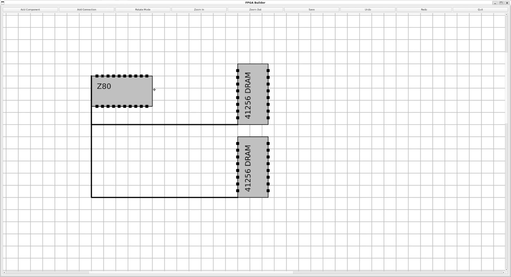

# FPGA Visual Builder - Build 19 (August 11, 2024)
[](https://www.python.org/downloads/)

FPGA Builder is a graphical tool for designing and simulating FPGA (Field-Programmable Gate Array) layouts. The tool allows users to create, rotate, and connect components with ease, providing a grid-based workspace that simplifies alignment and placement. 

This program is open-source.

## Features

- **Grid-Based Design**: Easily align components on a grid to maintain clean and organized layouts.
- **Add, Rotate, Delete Components**: Insert FPGA components, set their labels, adjust pin counts, rotate them to fit your design, and Right Click a component to delete it.
- **Create Connections**: Connect pins between components with a simple interface that prevents invalid connections.
- **Undo/Redo**: Easily correct mistakes or experiment with different layouts using the undo and redo functionalities.
- **Zoom In/Out**: Adjust the zoom level to fit more or fewer details on the screen.
- **Save and Load Projects**: Save your FPGA design as a (.fga) project file and load it later to continue your work.
- **Export to Image**: Export your FPGA design to an image file for documentation or sharing.

## Installation

To install FPGA Builder, ensure you have Python installed, then use the following steps:

1. Clone the repository:
    ```bash
    git clone https://github.com/alby13/fpga-visual-builder.git
    ```
2. Navigate to the project directory:
    ```bash
    cd fpga-visual-builder
    ```
3. Install the required dependencies:
    ```bash
    pip install -r requirements.txt
    ```
4. Run the application:
    ```bash
    python fpga_visual_builder.py
    ```

## Roadmap

Roadmap and Bugs text file has been added to the project. New Features, Suggested Functionality, and Bugs that need to be fixed are listed there.

## Requirements

PyQT5 can be downloaded here: https://pypi.org/project/PyQt5/

## License

[](https://www.gnu.org/licenses/gpl-3.0)

## Contributing

Contributions are welcome! If you'd like to improve FPGA Builder or add new features, feel free to submit a pull request. Please ensure your contributions are in line with the license terms.

## Contact

For questions, suggestions, or support, please post in the discussions.

